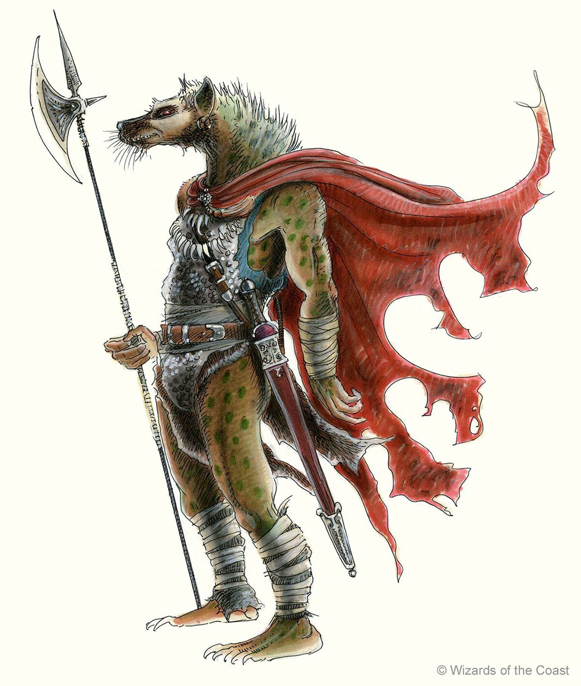

# Gnolls

- Tribal culture
- Right of might
- High appreciation of stealth, not considered dishonorable
- Magic users are shamans, combining arcane and religious magic
- Often use body modification as martial signs of honor and prowess
    - Shaved heads / manes
    - Dyed hair
    - Piercings
    - War paint
- Culture is martial, no gnoll farmers, most peaceful existence possible for gnoll clan is to live as hunters, with the occasional raid on neighboring people
    - The better integrated gnoll clans have their warriors and assassins serve in military context as outlet for their inherent need for violence
- Culture is originally nomadic and even permanent settlements typically still mostly use tents (gnolls have beautiful tents with tribal symbols and decorations on them)
- Each clan is led by an alpha called the master killer, a position earned by murdering the previous one, although a handful manage to retire alive
- Gnolls are known to have sharp and dark humor, not always intelligible to non-gnolls, but quite often it is
    - It is not uncommon to find gnolls snickering together about something during a major battle

## Snarling gnolls

These gnolls have longer snout and are better at stealth than their distant cousins. They are also more individualistic and as a race can be called morally ambiguous. Some clans have found a place for themselves among the races in the northern lands, while others still fight for evil masters of dark realms.

## Cackling gnolls

The gnolls have a closer facial resemblance to actual hyenas. They have a stronger pack mentality that leads them to greater violence and less intelligence. When separated from their packs a individual cackling gnoll is no less intelligent than their distant cousins, but will try to rejoin his group as soon as possible.

## Playing a gnoll

A PC will typically be a snarling gnoll. A snarling gnoll character gets the following powers at character creation:

- Large
- Fast
- Stealth boost
- Natural weapons
- Enhanced smell
